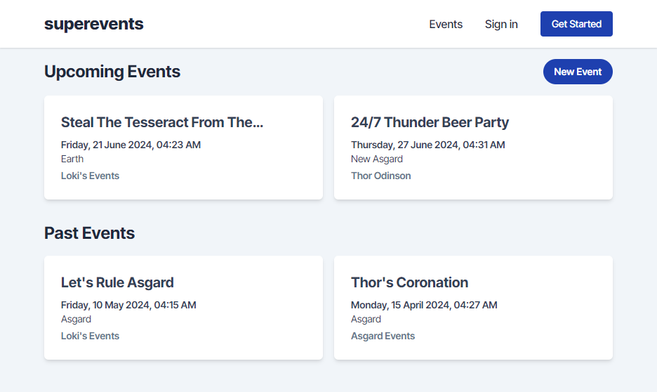
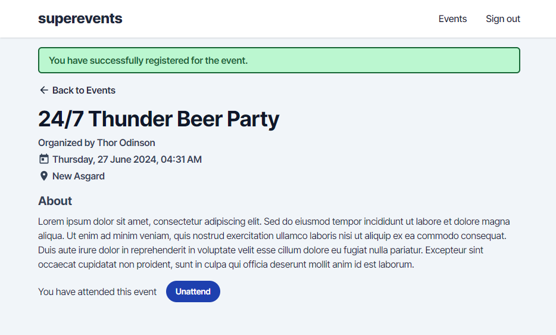
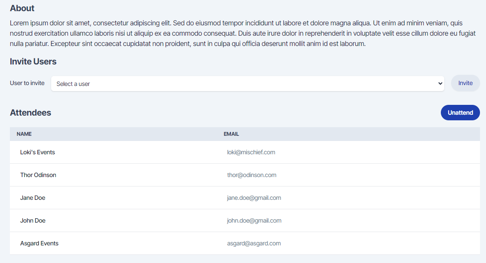
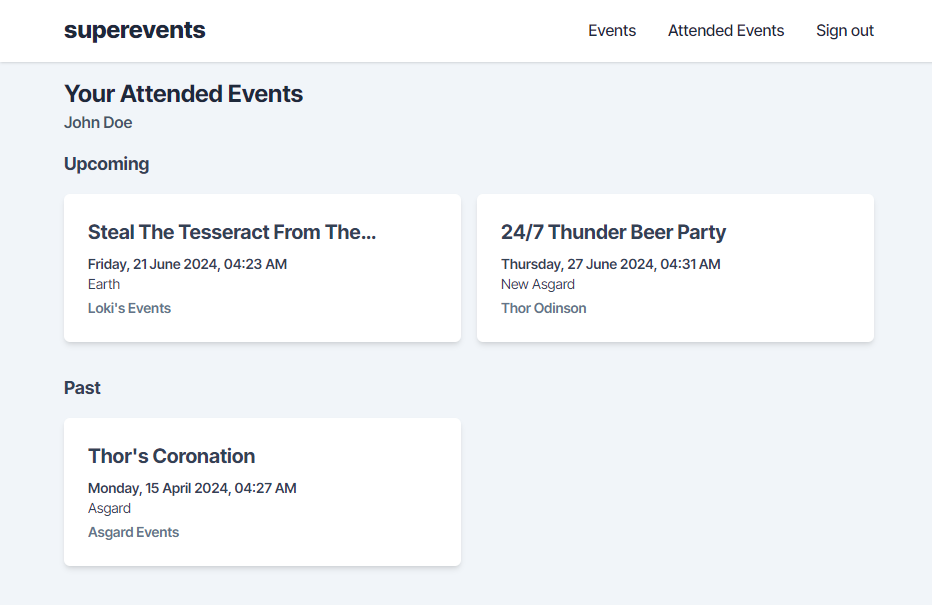

# private-events

This is part of the Forms Project in The Odin Project’s Ruby on Rails Curriculum. Find it at <https://www.theodinproject.com/lessons/ruby-on-rails-private-events>

## Screenshots

